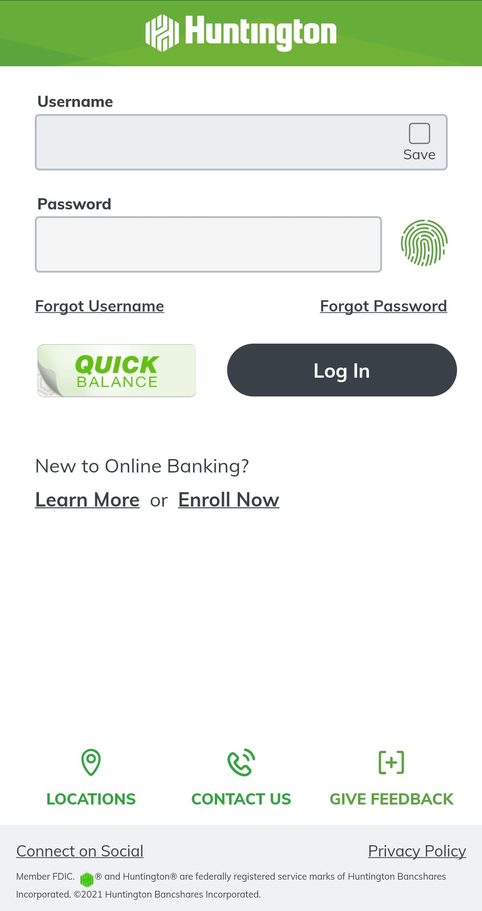
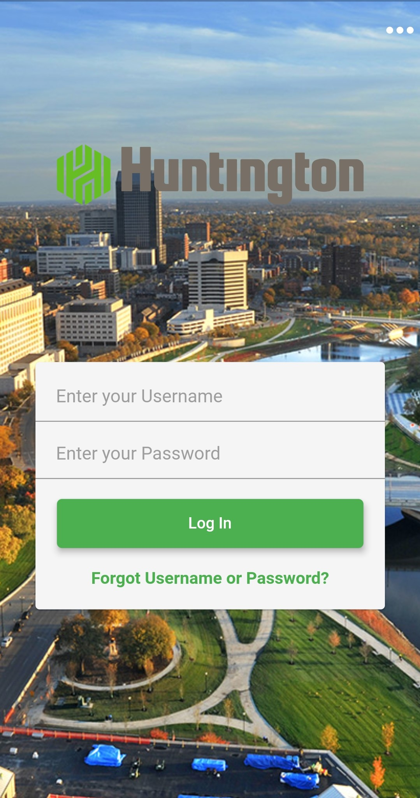
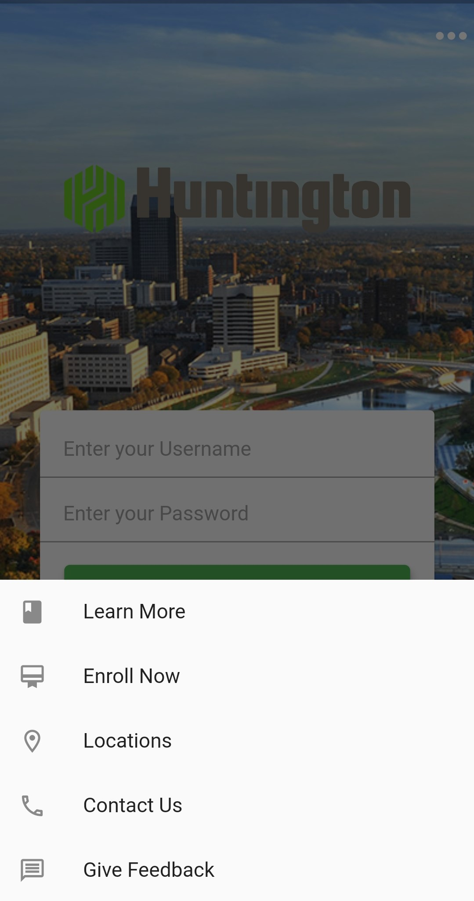

# HuntingtonBank

This is my version of a redesigned Huntington Bank mobile app landing page. 

I removed the Learn More, Enroll Now, Locations, Contact Us, and Give Feedback options from the user's sight and hid them in a modal bottom sheet. The user can view these options by tapping on the More Options icon at the top right corner of the screen. Doing so pulls up a modal bottom sheet from the bottom of the screen with the five options mentioned earlier. I also combined the Forgot Username and Forgot Password options into one option titled 'Forgot Username or Password?' to reduce the number of options on screen.

Developed by London Tran 
https://twitter.com/londontran 
https://www.linkedin.com/in/londontran 

Before            |  After 1
:-------------------------:|:-------------------------:
  |  
After 2

