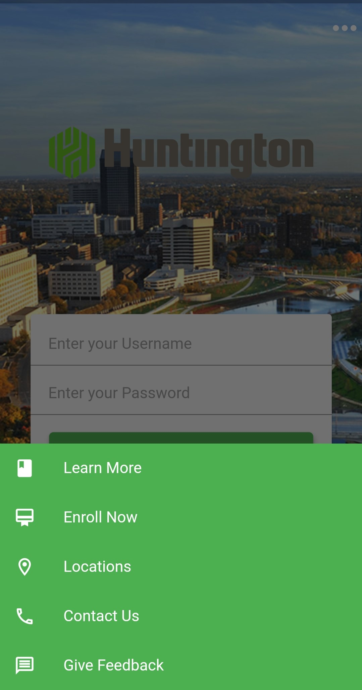

# HuntingtonBank

This is my version of a redesigned Huntington Bank mobile app landing page. 

In this redesign, I wanted to focus on removing as many clickable options from the screen as possible to give a succinct user experience and only show additional options when necessary.

I removed the 'Learn More', 'Enroll Now', 'Locations', 'Contact Us', and 'Give Feedback' options from the user's sight and hid them in a modal bottom sheet. The user can view these options by tapping on the 'More' Icon at the top right corner of the screen. Doing so pulls up a modal bottom sheet with the same five options. I also combined the 'Forgot Username' and 'Forgot Password' options into one option titled 'Forgot Username or Password?'.

Two things I would change with my redesign if given more time: 
 1) I would opt for a Huntington logo with white text so that it looks better against the background image. I've tried looking for a PNG image of the Huntington logo in white but couldn't find one.  
2) I would reposition the 'More' Icon that's in the top right corner of the screen and place it centered at the bottom of the screen. Instead of using an Icon, I would use a button.

Developed by London Tran 
https://twitter.com/londontran 
https://www.linkedin.com/in/londontran 

Before            |  After 1
:-------------------------:|:-------------------------:
  |  
After 2

